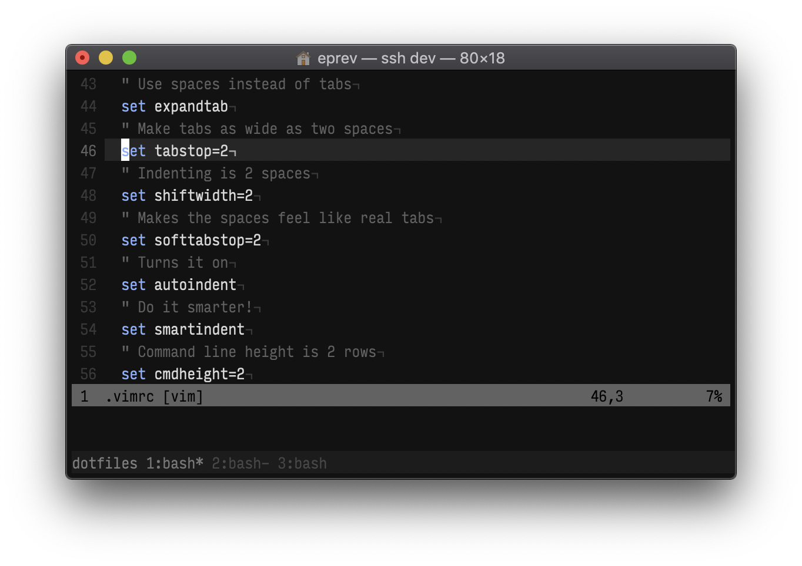

# ~/.*




## Setup

```
curl -L https://github.com/eprev/dotfiles/raw/master/bin/dot-install | bash
```

In addition, the following steps may be required:

* If you want to use [TagBar](http://majutsushi.github.io/tagbar/), you need to install exuberant-ctags (or simply run `dot-install-osx`):

    ```
    brew install ctags-exuberant
    ```

* You might want to try [locationchanger](https://github.com/eprev/locationchanger).

* Like the font in the screenshot? It's [Input Font](http://input.fontbureau.com/) (InputMonoCondensed-Light, 13pt).

## Update

```
dot-update
```
