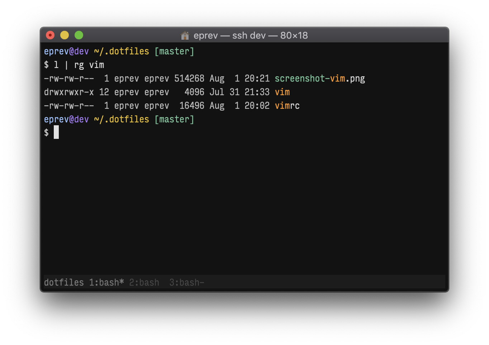

# ~/.*



Install/Update:

```
curl -L https://github.com/eprev/dotfiles/raw/master/install.sh | bash
```

In addition, the following steps may be required when you want:

* To use [TagBar](http://majutsushi.github.io/tagbar/) you need to install exuberant-ctags:

    ```
    brew install ctags-exuberant
    ```

* You might want to try [locationchanger](https://github.com/eprev/locationchanger):

    ```
    curl -L https://github.com/eprev/locationchanger/raw/master/locationchanger.sh | bash
    ```

* Like the font in the screenshot? [Input Font](http://input.fontbureau.com/).
